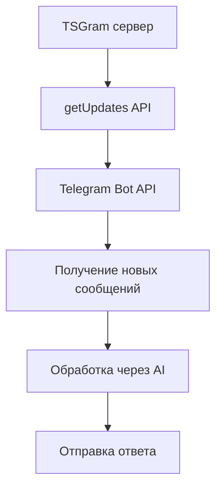

# Запуск TSGram MCP в режиме Polling

## Быстрый старт (Docker)

### 1. Установите переменные окружения
Создайте файл `.env` на основе `.env.example`:
```bash
cp .env.example .env
```

Отредактируйте `.env`:
```env
TELEGRAM_BOT_TOKEN=ваш_бот_токен_от_BotFather
AUTHORIZED_CHAT_ID=ваш_telegram_user_id_от_userinfobot
OPENROUTER_API_KEY=ваш_openrouter_ключ
# ИЛИ
DEEPSEEK_API_KEY=ваш_deepseek_ключ
```

### 2. Соберите и запустите
```bash
npm run docker:build
npm run docker:start
```

### 3. Проверьте логи
```bash
npm run docker:logs
```

Вы должны увидеть:
```
📥 Webhook endpoint: http://localhost:4041/webhook/telegram
```
Это нормально - endpoint показывается, но используется polling.

### 4. Проверьте статус
```bash
npm run docker:health
```

### 5. Откройте dashboard
```bash
npm run dashboard
```
Перейдите в браузере на http://localhost:3000

## Как работает Polling



### Преимущества Polling:
- ✅ Работает без публичного сервера
- ✅ Не требует настройки webhook
- ✅ Простая конфигурация
- ✅ Работает за NAT/Firewall

### Недостатки Polling:
- ❌ Задержка до 30 секунд
- ❌ Больше запросов к API
- ❌ Менее эффективно

## Тестирование бота

1. Напишите сообщение вашему боту в Telegram
2. Проверьте логи: `npm run docker:logs`
3. Бот должен ответить через AI

## Решение проблем

### Бот не отвечает:
```bash
# Проверьте переменные окружения
docker-compose -f docker-compose.tsgram-workspace.yml exec tsgram-mcp-workspace env | grep -E "(TELEGRAM|AUTHORIZED|OPENROUTER)"

# Проверьте логи
npm run docker:logs
```

### Ошибка авторизации:
- Убедитесь, что AUTHORIZED_CHAT_ID - это числовой ID, а не username
- Получите ID от @userinfobot

### Проблемы с API ключами:
- Проверьте OPENROUTER_API_KEY или DEEPSEEK_API_KEY
- Убедитесь, что у вас есть баланс