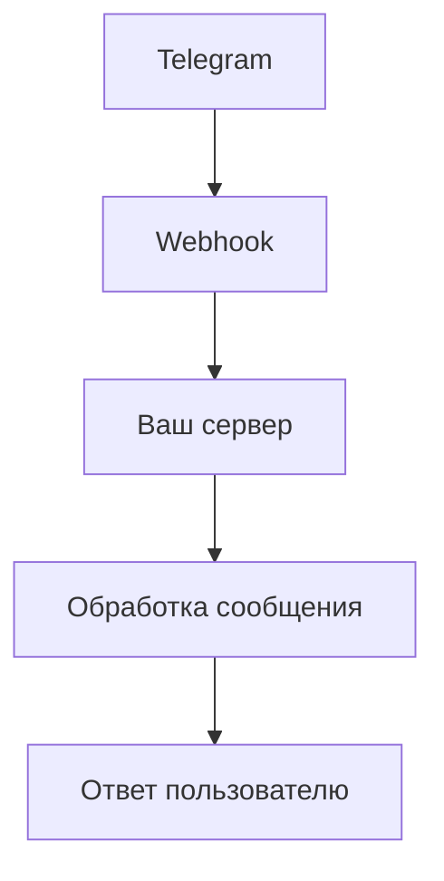

# Настройка Webhook для Telegram бота

## Текущая ситуация
Проект tsgram-mcp поддерживает два режима получения сообщений:
1. **Polling** (текущий) - бот сам запрашивает новые сообщения у Telegram API
2. **Webhook** - Telegram отправляет сообщения на ваш сервер

## Проблема с localhost
Endpoint `http://localhost:4041/webhook/telegram` недоступен извне, поэтому Telegram не может отправлять webhook'и.

## Варианты решения

### Вариант 1: Продолжить использовать Polling (рекомендуется)
- Преимущества: работает без дополнительной настройки, не требует публичного сервера
- Недостатки: менее эффективно, задержки до 30 секунд

### Вариант 2: Настроить Webhook с публичным URL

#### Шаг 1: Получить публичный HTTPS URL
```bash
# Использовать ngrok для тестирования
npm install -g ngrok
ngrok http 4041
# Получите HTTPS URL от ngrok
```

#### Шаг 2: Настроить переменную окружения
```env
WEBHOOK_BASE_URL=https://your-ngrok-url.ngrok.io
```

#### Шаг 3: Изменить код для использования webhook вместо polling
Нужно модифицировать `telegram-bot-ai-powered.ts` чтобы использовать webhook'и.

#### Шаг 4: Настроить webhook в Telegram
```bash
curl -X POST "https://api.telegram.org/bot<YOUR_BOT_TOKEN>/setWebhook?url=https://your-ngrok-url.ngrok.io/webhook/telegram"
```

## Архитектура с Webhook



## Архитектура с Polling

```mermaid
graph TD
    A[Ваш сервер] --> B[getUpdates API]
    B --> C[Telegram]
    C --> D[Обработка новых сообщений]
    D --> E[Ответ пользователю]